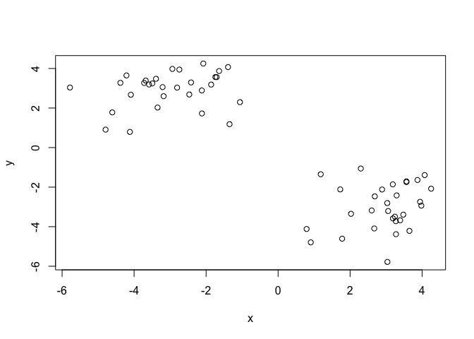
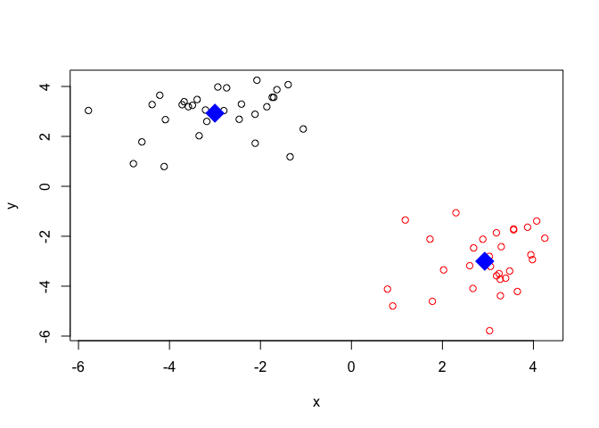
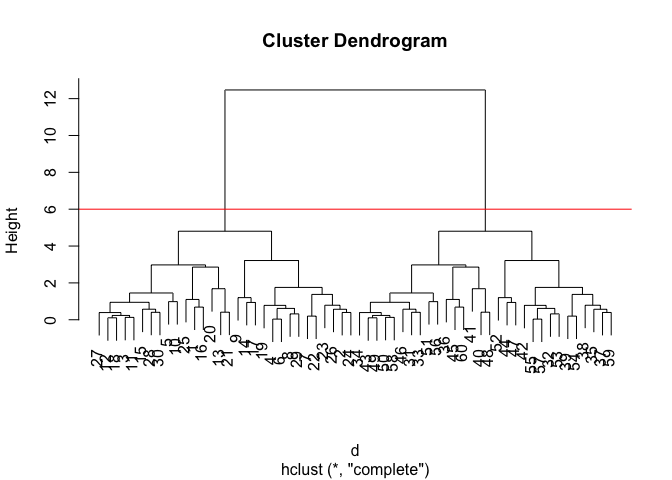
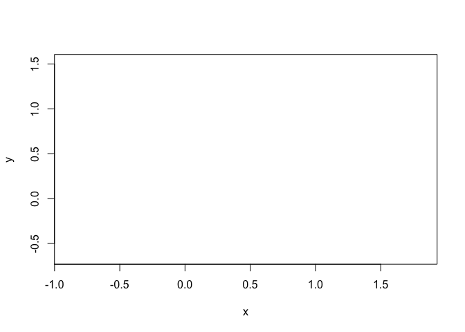
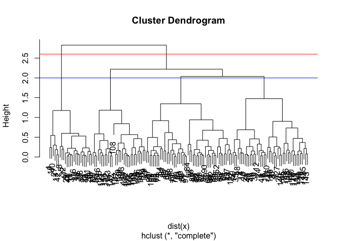
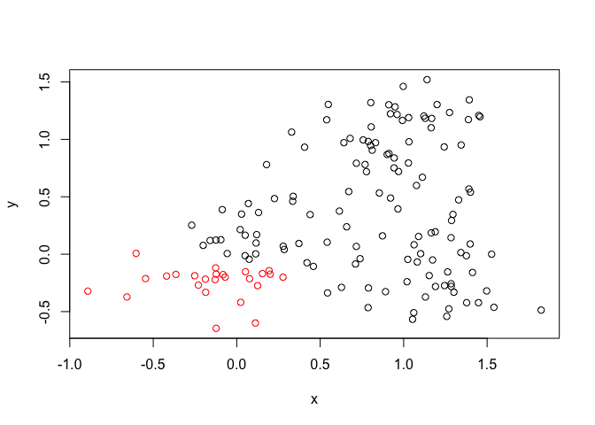
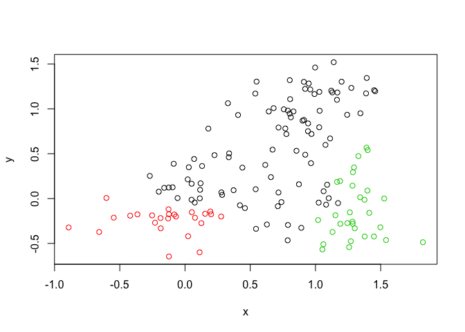
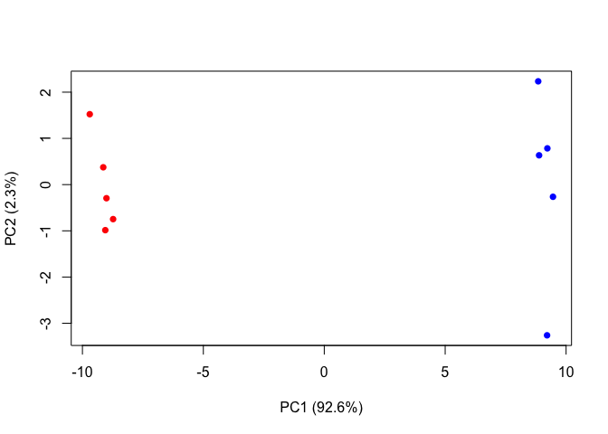
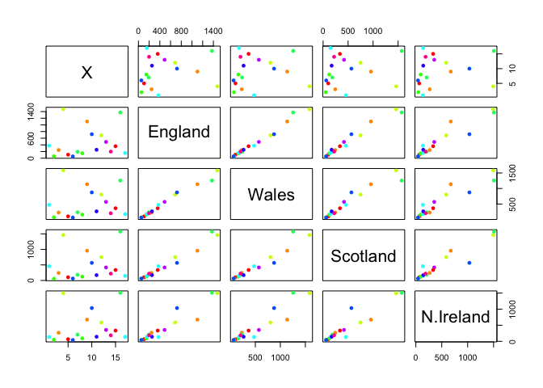
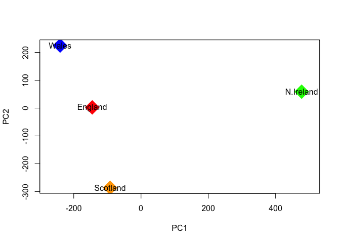

Class 8: Machine Learning
================
Ezequiel Quevedo
4/25/2019

## k-means clustering

Let’s start with an example of running the **kmeans()** function

``` r
# Generate some example data for clustering
tmp <- c(rnorm(30,-3), rnorm(30,3)) # 30 points centered around -3 & 3
x <- cbind(x=tmp, y=rev(tmp))

plot(x)
```

<!-- -->

Task: Use the kmeans() function setting k to 2 and nstart=20

Inspect/print the results

> Q. How many points are in each cluster? 30 km$size

> Q. What ‘component’ of your result object details - cluster size? -
> cluster assignment/membership? - cluster center?

> Plot x colored by the kmeans cluster assignment and add cluster
> centers as blue points

``` r
ss <- kmeans(x, centers = 2, nstart = 20)
ss
```

    ## K-means clustering with 2 clusters of sizes 30, 30
    ## 
    ## Cluster means:
    ##           x         y
    ## 1 -3.000668  2.930054
    ## 2  2.930054 -3.000668
    ## 
    ## Clustering vector:
    ##  [1] 1 1 1 1 1 1 1 1 1 1 1 1 1 1 1 1 1 1 1 1 1 1 1 1 1 1 1 1 1 1 2 2 2 2 2
    ## [36] 2 2 2 2 2 2 2 2 2 2 2 2 2 2 2 2 2 2 2 2 2 2 2 2 2
    ## 
    ## Within cluster sum of squares by cluster:
    ## [1] 64.3573 64.3573
    ##  (between_SS / total_SS =  89.1 %)
    ## 
    ## Available components:
    ## 
    ## [1] "cluster"      "centers"      "totss"        "withinss"    
    ## [5] "tot.withinss" "betweenss"    "size"         "iter"        
    ## [9] "ifault"

``` r
# cluster size
ss$size
```

    ## [1] 30 30

``` r
# cluster assignment
ss$cluster
```

    ##  [1] 1 1 1 1 1 1 1 1 1 1 1 1 1 1 1 1 1 1 1 1 1 1 1 1 1 1 1 1 1 1 2 2 2 2 2
    ## [36] 2 2 2 2 2 2 2 2 2 2 2 2 2 2 2 2 2 2 2 2 2 2 2 2 2

``` r
# cluster center
ss$centers
```

    ##           x         y
    ## 1 -3.000668  2.930054
    ## 2  2.930054 -3.000668

``` r
plot(x, col=ss$cluster)
points(ss$centers, pch=18, col="blue", cex=3)
```

<!-- -->

## Heirarchical Clustering

### something you can code as a measure of similarity

We must five the **hclust()** function a distance matrix **not the raw
data** as input

``` r
# distance matrix calculation
d <- dist(x)

#clustering
hc <- hclust(d)
plot(hc)

# plot line
abline(h=6, col="red")
```

<!-- -->

``` r
# cut tree
cutree(hc, h=6)
```

    ##  [1] 1 1 1 1 1 1 1 1 1 1 1 1 1 1 1 1 1 1 1 1 1 1 1 1 1 1 1 1 1 1 2 2 2 2 2
    ## [36] 2 2 2 2 2 2 2 2 2 2 2 2 2 2 2 2 2 2 2 2 2 2 2 2 2

``` r
cutree(hc, k=2)
```

    ##  [1] 1 1 1 1 1 1 1 1 1 1 1 1 1 1 1 1 1 1 1 1 1 1 1 1 1 1 1 1 1 1 2 2 2 2 2
    ## [36] 2 2 2 2 2 2 2 2 2 2 2 2 2 2 2 2 2 2 2 2 2 2 2 2 2

``` r
cutree(hc, k=3)
```

    ##  [1] 1 1 1 1 1 1 1 1 1 1 1 1 1 1 1 1 1 1 1 1 1 1 1 1 1 1 1 1 1 1 2 3 2 2 3
    ## [36] 2 3 3 3 2 2 3 2 3 2 2 3 2 2 2 2 3 3 3 3 2 3 2 3 2

> # What do you notice?
> 
> There are two major clusters that are separated into smaller lineages
> of clusters \# Does the dendrogram make sense based on your knowledge
> of x? Each cluster has 30 points The grouping pattern (height, bc
> we’re using distance data). The greatest height is between the
> centers of both clusters (~7)

> # Step 1. Generate some example data for clustering
> 
> x \<- rbind( matrix(rnorm(100, mean=0, sd = 0.3), ncol = 2), \# c1
> matrix(rnorm(100, mean = 1, sd = 0.3), ncol = 2), \# c2
> matrix(c(rnorm(50, mean = 1, sd = 0.3), \# c3 rnorm(50, mean = 0, sd =
> 0.3)), ncol = 2)) colnames(x) \<- c(“x”, “y”) \# Step 2. Plot the data
> without clustering plot(x) \# Step 3. Generate colors for known
> clusters \# (just so we can compare to hclust results) col \<-
> as.factor( rep(c(“c1”,“c2”,“c3”), each=50) ) plot(x, col=col) Your
> Turn\! Q. Use the dist(), hclust(), plot() and cutree() functions to
> return 2 and 3 clusters Q. How does this compare to your known ‘col’
> groups?

``` r
# Step 1. Generate some example data for clustering
x <- rbind(
  matrix(rnorm(100, mean=0, sd = 0.3), ncol = 2), # c1
  matrix(rnorm(100, mean = 1, sd = 0.3), ncol = 2), # c2
  matrix(c(rnorm(50, mean = 1, sd = 0.3), # c3
  rnorm(50, mean = 0, sd = 0.3)), ncol = 2))
colnames(x) <- c("x", "y")
# Step 2. Plot the data without clustering
plot(x, col=col)
```

    ## Warning in plot.xy(xy, type, ...): supplied color is neither numeric nor
    ## character

<!-- -->

``` r
# Step 3. Generate colors for known clusters
# (just so we can compare to hclust results)
col <- as.factor( rep(c("c1","c2","c3"), each=50) )
```

> Q. Use the dist(), hclust(), plot() and cutree() functions to return 2
> and 3 clusters Q. How does this compare to your known ‘col’ groups?

``` r
hc <- hclust(dist(x))
plot(hc)

abline(h=2, col="blue")
abline(h=2.6, col="red")
```

<!-- -->

``` r
gp2 <- cutree(hc, k=2)
gp3 <- cutree(hc, k=3)

gp2
```

    ##   [1] 1 1 1 2 2 1 1 2 1 2 1 1 2 1 2 2 2 1 1 1 1 2 2 1 1 1 2 2 2 2 2 1 2 2 1
    ##  [36] 2 2 2 1 2 2 2 1 2 1 1 2 1 1 1 1 1 1 1 1 1 1 1 1 1 1 1 1 1 1 1 1 1 1 1
    ##  [71] 1 1 1 1 1 1 1 1 1 1 1 1 1 1 1 1 1 1 1 1 1 1 1 1 1 1 1 1 1 1 1 1 1 1 1
    ## [106] 1 1 1 1 1 1 1 1 1 1 1 1 1 1 1 1 1 1 1 1 1 1 1 1 1 1 1 1 1 1 1 1 1 1 1
    ## [141] 1 1 1 1 1 1 1 1 1 1

``` r
gp3
```

    ##   [1] 1 1 1 2 2 1 1 2 1 2 1 1 2 1 2 2 2 1 1 1 1 2 2 1 1 1 2 2 2 2 2 1 2 2 1
    ##  [36] 2 2 2 1 2 2 2 1 2 1 1 2 1 1 1 1 1 1 3 3 1 1 1 1 1 1 1 1 1 1 1 1 1 1 1
    ##  [71] 1 1 1 1 1 1 1 1 1 1 1 1 1 1 1 1 1 1 1 1 1 1 1 1 1 1 1 1 1 1 3 3 3 3 3
    ## [106] 1 3 3 3 1 3 1 1 3 3 3 3 1 1 1 3 3 1 3 3 1 1 1 3 3 3 3 3 1 1 3 1 1 3 1
    ## [141] 3 3 1 3 1 1 3 3 1 1

``` r
plot(x, col=gp2)
```

<!-- -->

``` r
plot(x, col=gp3) # looks for non-overlapping groups of data
```

<!-- -->

``` r
table(gp2)
```

    ## gp2
    ##   1   2 
    ## 125  25

``` r
table(gp3)
```

    ## gp3
    ##  1  2  3 
    ## 94 25 31

``` r
table(gp2, gp3) # cross-tabulating
```

    ##    gp3
    ## gp2  1  2  3
    ##   1 94  0 31
    ##   2  0 25  0

# PCA: Principal Component Analysis of RefSeq data

we will use the **prcomp()** function for PCA

``` r
# Example Data
## You can also download this file from the class website!
mydata <- read.csv("https://tinyurl.com/expression-CSV",
  row.names=1)
head(mydata)
```

    ##        wt1 wt2  wt3  wt4 wt5 ko1 ko2 ko3 ko4 ko5
    ## gene1  439 458  408  429 420  90  88  86  90  93
    ## gene2  219 200  204  210 187 427 423 434 433 426
    ## gene3 1006 989 1030 1017 973 252 237 238 226 210
    ## gene4  783 792  829  856 760 849 856 835 885 894
    ## gene5  181 249  204  244 225 277 305 272 270 279
    ## gene6  460 502  491  491 493 612 594 577 618 638

``` r
# how many genes are in this data?
nrow(mydata)
```

    ## [1] 100

``` r
# how many variants are in this data?
ncol(mydata)
```

    ## [1] 10

``` r
# what are the names of our variants?
colnames(mydata)
```

    ##  [1] "wt1" "wt2" "wt3" "wt4" "wt5" "ko1" "ko2" "ko3" "ko4" "ko5"

\#prcomp() expects the transpose of our data (our rows are now columns,
and vice
    versa)

``` r
head(t(mydata))
```

    ##     gene1 gene2 gene3 gene4 gene5 gene6 gene7 gene8 gene9 gene10 gene11
    ## wt1   439   219  1006   783   181   460    27   175   658    121    337
    ## wt2   458   200   989   792   249   502    30   182   669    116    337
    ## wt3   408   204  1030   829   204   491    37   184   653    134    330
    ## wt4   429   210  1017   856   244   491    29   166   633    117    322
    ## wt5   420   187   973   760   225   493    34   180   657    133    313
    ## ko1    90   427   252   849   277   612   304   255   628    931    100
    ##     gene12 gene13 gene14 gene15 gene16 gene17 gene18 gene19 gene20 gene21
    ## wt1    214    789    458    551    390    900    951    436    244    119
    ## wt2    194    738    490    555    400    970    991    414    266     87
    ## wt3    213    807    493    527    403    905    991    388    228     87
    ## wt4    192    768    446    552    402    850    983    418    223     88
    ## wt5    207    820    496    503    401    834    984    410    240     93
    ## ko1     97    293    694    712    755    353    217    162    540    914
    ##     gene22 gene23 gene24 gene25 gene26 gene27 gene28 gene29 gene30 gene31
    ## wt1    156     89    570    788   1007    937    224    809    624    218
    ## wt2    170     97    567    796    972    876    232    869    598    259
    ## wt3    150     96    563    766    977    901    231    815    587    213
    ## wt4    167     97    587    778   1003    958    238    788    552    204
    ## wt5    155     82    563    825   1027    957    226    781    592    213
    ## ko1    346    788    424    456    945    414    850    482    956     69
    ##     gene32 gene33 gene34 gene35 gene36 gene37 gene38 gene39 gene40 gene41
    ## wt1    906    262    155    100    117    286    321    388    606    379
    ## wt2    798    291    172    104    147    262    353    372    576    377
    ## wt3    828    258    173     94    120    260    334    345    558    362
    ## wt4    874    271    173    114    147    270    340    373    581    346
    ## wt5    890    279    192     90    145    293    316    359    574    354
    ## ko1    541    534    643    212    353    360    642     50    415    991
    ##     gene42 gene43 gene44 gene45 gene46 gene47 gene48 gene49 gene50 gene51
    ## wt1    471    592    755     35    758     24    100    809    955    453
    ## wt2    492    615    733     40    734     25    113    825    994    419
    ## wt3    473    602    775     28    704     12    136    833    994    443
    ## wt4    470    602    687     25    761     13    117    800    975    459
    ## wt5    471    655    776     32    672     22    103    776    973    469
    ## ko1    401    514    255    947    567    324    912    538    175    174
    ##     gene52 gene53 gene54 gene55 gene56 gene57 gene58 gene59 gene60 gene61
    ## wt1    327    657    678    304    659    673    785    501    232    928
    ## wt2    320    669    638    325    687    668    772    513    228    936
    ## wt3    324    631    676    312    659    694    817    462    193   1015
    ## wt4    321    701    683    327    667    699    766    484    247    971
    ## wt5    318    647    671    320    639    726    784    504    231    964
    ## ko1    489    246    259    819    109     18    467     37    997    428
    ##     gene62 gene63 gene64 gene65 gene66 gene67 gene68 gene69 gene70 gene71
    ## wt1    159    336    968    339     35     27     80    744    766    672
    ## wt2    169    344    888    335     32     28     69    685    739    736
    ## wt3    163    372    907    373     45     25     87    733    751    672
    ## wt4    151    389    914    338     37     35     87    693    720    715
    ## wt5    166    357    883    328     38     27     81    746    738    693
    ## ko1    869    664    886    275    765    200    693    745    645    839
    ##     gene72 gene73 gene74 gene75 gene76 gene77 gene78 gene79 gene80 gene81
    ## wt1    526    627    468    986    348    719    883    837    666    804
    ## wt2    553    650    466    945    333    714    899    883    657    735
    ## wt3    534    664    477   1006    344    734    868    864    719    771
    ## wt4    511    622    469   1020    321    693    873    807    656    763
    ## wt5    529    606    494   1024    296    682    882    854    638    813
    ## ko1    922    805    703    359    770    620    803    210    549    613
    ##     gene82 gene83 gene84 gene85 gene86 gene87 gene88 gene89 gene90 gene91
    ## wt1    476    438    938     29    810    575    451    174    158    371
    ## wt2    494    430    934     29    830    579    471    170    122    367
    ## wt3    521    477    976     30    760    567    494    205    138    369
    ## wt4    494    457    965     19    796    565    447    175    159    339
    ## wt5    482    481    960     21    807    576    470    179    128    360
    ## ko1    183    466    904    618    486    352    540    298    863    103
    ##     gene92 gene93 gene94 gene95 gene96 gene97 gene98 gene99 gene100
    ## wt1    853    208    555    527    589    396     33    321      25
    ## wt2    798    214    584    573    607    384     27    343      34
    ## wt3    866    200    574    548    579    382     39    349      34
    ## wt4    843    196    599    548    536    399     42    367      36
    ## wt5    823    206    581    552    583    401     33    343      32
    ## ko1    934    409    292    686    497    460    977    949     661

Run our PCA analysis on the transpose of our data.

``` r
pca <- prcomp(t(mydata), scale=TRUE)
```

``` r
# a basic PC1 vs PC2 plot
plot(pca$x[,1], pca$x[,2], xlab="PC1", ylab="PC2")
```

<!-- -->

A little extra work to find the variance using **prcomp()**

``` r
## percent variance is often more informative to look at
pca.var <- pca$sdev^2 # square of the deviation
pca.var.per <- round(pca.var/sum(pca.var)*100, 1)

head(pca.var.per)
```

    ## [1] 92.6  2.3  1.1  1.1  0.8  0.7

``` r
barplot(pca.var.per, main="Scree Plot",
xlab="Principal Component", ylab="Percent Variation")
```

<!-- -->

A more useful plot:

``` r
## A vector of colors for wt and ko samples
colvec <- colnames(mydata)
colvec[grep("wt", colvec)] <- "red"
colvec[grep("ko", colvec)] <- "blue"
plot(pca$x[,1], pca$x[,2], col=colvec, pch=16,
xlab=paste0("PC1 (", pca.var.per[1], "%)"),
ylab=paste0("PC2 (", pca.var.per[2], "%)"))

## Click to identify which sample is which
identify(pca$x[,1], pca$x[,2], labels=colnames(mydata))
```

<!-- -->

    ## integer(0)

``` r
## Press ESC to exit…
```

# PRACTICE

``` r
# read-in data
z <- read.csv("https://bioboot.github.io/bggn213_f17/class-material/UK_foods.csv")
y <- read.csv("https://bioboot.github.io/bggn213_f17/class-material/UK_foods.csv", 
              row.names = 1)
```

> Q1. How many rows and columns are in your new data frame named x? What
> R functions could you use to answer this questions?

``` r
dim(z)
```

    ## [1] 17  5

``` r
dim(y)
```

    ## [1] 17  4

> Check data

``` r
View(z) # show all
View(y)
```

``` r
#just the tip
head(z)
```

    ##                X England Wales Scotland N.Ireland
    ## 1         Cheese     105   103      103        66
    ## 2  Carcass_meat      245   227      242       267
    ## 3    Other_meat      685   803      750       586
    ## 4           Fish     147   160      122        93
    ## 5 Fats_and_oils      193   235      184       209
    ## 6         Sugars     156   175      147       139

``` r
head(y)
```

    ##                England Wales Scotland N.Ireland
    ## Cheese             105   103      103        66
    ## Carcass_meat       245   227      242       267
    ## Other_meat         685   803      750       586
    ## Fish               147   160      122        93
    ## Fats_and_oils      193   235      184       209
    ## Sugars             156   175      147       139

> Identify major patterns and trends

``` r
barplot(as.matrix(y), beside=T, col=rainbow(nrow(y)))
```

<!-- -->

> Make a stacked plot

``` r
barplot(as.matrix(y), beside=F, col=rainbow(nrow(y)))
```

<!-- -->

> Q5: Generating all pairwise plots may help somewhat. Can you make
> sense of the following code and resulting figure? What does it mean if
> a given point lies on the diagonal for a given plot?

``` r
pairs(z, col=rainbow(10), pch=16)
```

<!-- -->

``` r
pairs(y, col=rainbow(10), pch=16)
```

<!-- -->

> Q6. What is the main differences between N. Ireland and the other
> countries of the UK in terms of this data-set?

### PCA to the rescue: **prcomp( t() )**

``` r
# Use the prcomp() PCA function 
pca <- prcomp( t(y) )
summary(pca)
```

    ## Importance of components:
    ##                             PC1      PC2      PC3       PC4
    ## Standard deviation     324.1502 212.7478 73.87622 4.189e-14
    ## Proportion of Variance   0.6744   0.2905  0.03503 0.000e+00
    ## Cumulative Proportion    0.6744   0.9650  1.00000 1.000e+00

Note that PC1 captures 67.44% of the variation. PC1 and PC2 capture
96.50% of the variation. **literature: “the first two principal
components capture 96.50% of the variation.”**

> Q7. Complete the code below to generate a plot of PC1 vs PC2. The
> second line adds text labels over the data points.

``` r
# Plot PC1 vs PC2
plot(pca$x[,1], pca$x[,2], xlab="PC1", ylab="PC2", xlim=c(-270,500), 
     col=c("red", "blue", "orange", "green"), pch=18, cex=4)
text(pca$x[,1], pca$x[,2], colnames(y))
```

<!-- -->

## What did you find out from our PCA, and how?

``` r
## Lets focus on PC1 as it accounts for > 90% of variance 
par(mar=c(10, 3, 0.35, 0))
barplot( pca$rotation[,1], las=2 )
```

<!-- -->
