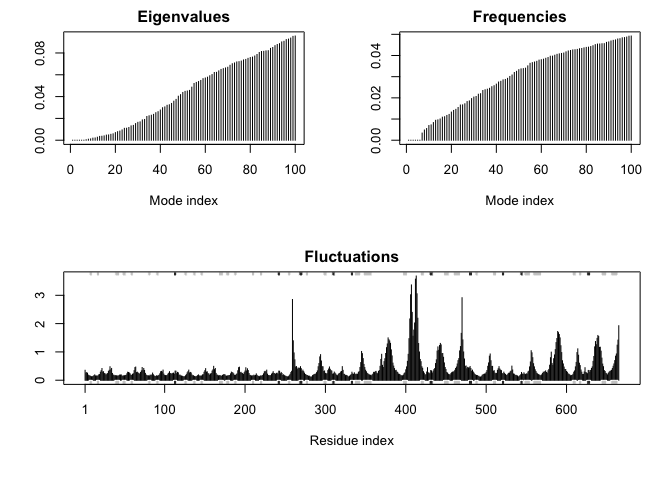
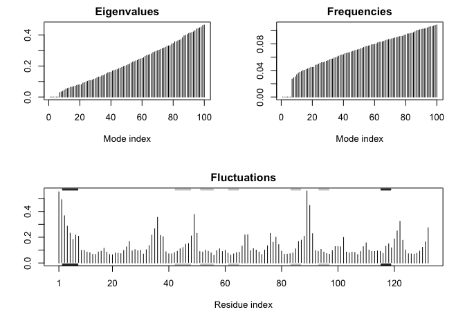

BIBC103 (§A01): Fibroblast Growth Factor
================
Ezequiel Quevedo

## Normal Mode analysis for flexibility prediction of ternary FGF2-FGFR1-Heparin complex

> DOI: 10.2210/pdb1FQ9/pdb Classification: GROWTH FACTOR/GROWTH FACTOR
> RECEPTOR Organism(s): Homo sapiens Expression System: Escherichia coli
> Mutation(s): 3

> Deposited: 2000-09-04 Released: 2000-09-27 Deposition Author(s):
> Schlessinger, J., Plotnikov, A.N., Ibrahimi, O.A., Eliseenkova, A.V.,
> Yeh, B.K., Yayon, A., Linhardt, R.J., Mohammadi, M.

``` r
library(bio3d)

pdb <- read.pdb("1FQ9")
```

    ##   Note: Accessing on-line PDB file

``` r
modes <- nma(pdb)
```

    ## Warning in nma.pdb(pdb): Possible multi-chain structure or missing in-structure residue(s) present
    ##   Fluctuations at neighboring positions may be affected.

    ##  Building Hessian...     Done in 0.278 seconds.
    ##  Diagonalizing Hessian...    Done in 9.516 seconds.

``` r
plot(modes, sse = pdb)
```

<!-- -->

``` r
# Visualize NMA results
mktrj(modes, mode = 7, file = "1fq9_nma_7.pdb")
```

## Normal Mode analysis for flexibility prediction of FGF2-FGFR1 complex

> DOI: 10.2210/pdb1CVS/pdb Classification: GROWTH FACTOR/GROWTH FACTOR
> RECEPTOR Organism(s): Homo sapiens Expression System: Escherichia coli
> Mutation(s): 3

> Deposited: 1999-08-24 Released: 2000-01-28 Deposition Author(s):
> Plotnikov, A.N., Schlessinger, J., Hubbard, S.R., Mohammadi, M.
> Experimental Data Snapshot

> Method: X-RAY DIFFRACTION Resolution: 2.8 Å R-Value Free: 0.281
> R-Value Work: 0.240

``` r
library(bio3d)

pdb <- read.pdb("1CVS")
```

    ##   Note: Accessing on-line PDB file

``` r
modes <- nma(pdb)
```

    ## Warning in nma.pdb(pdb): Possible multi-chain structure or missing in-structure residue(s) present
    ##   Fluctuations at neighboring positions may be affected.

    ##  Building Hessian...     Done in 0.226 seconds.
    ##  Diagonalizing Hessian...    Done in 9.698 seconds.

``` r
plot(modes, sse = pdb)
```

<!-- -->

``` r
# Visualize NMA results
mktrj(modes, mode = 7, file = "1cvs_nma_7.pdb")
```

## Normal Mode analysis for flexibility prediction FGF2-Disaccharide (S3I2) complex

> DOI: 10.2210/pdb4OEE/pdb Classification: PROTEIN BINDING Organism(s):
> Homo sapiens Expression System: Escherichia coli BL21 Mutation(s): 2

> Deposited: 2014-01-13 Released: 2014-07-09 Deposition Author(s): Li,
> Y.C., Hsiao, C.D. Experimental Data Snapshot

> Method: X-RAY DIFFRACTION Resolution: 1.5 Å R-Value Free: 0.185
> R-Value Work: 0.163

``` r
library(bio3d)

pdb <- read.pdb("4OEE")
```

    ##   Note: Accessing on-line PDB file

``` r
modes <- nma(pdb)
```

    ##  Building Hessian...     Done in 0.016 seconds.
    ##  Diagonalizing Hessian...    Done in 0.088 seconds.

``` r
plot(modes, sse = pdb)
```

<!-- -->

``` r
# Visualize NMA results
mktrj(modes, mode = 7, file = "4OEE_nma_7.pdb")
```
