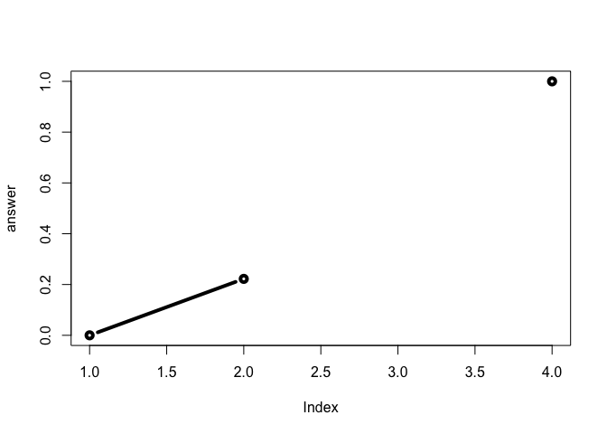

Class 6: R Functions
================
Ezequiel Quevedo
4/18/2019

# About

## About

### About

This is my **class 6** r markdown document with my *code* and notes for
the day.

<!-- -->

## Reading in files

There are 3 files to read:
<https://bioboot.github.io/bimm143_S19/class-material/test1.txt>
<https://bioboot.github.io/bimm143_S19/class-material/test2.txt>
<https://bioboot.github.io/bimm143_S19/class-material/test3.txt>

``` r
read.csv("test1.txt")
```

    ##   Col1 Col2 Col3
    ## 1    1    2    3
    ## 2    4    5    6
    ## 3    7    8    9
    ## 4    a    b    c

``` r
read.table("test2.txt", sep = "$", header = TRUE)
```

    ##   Col1 Col2 Col3
    ## 1    1    2    3
    ## 2    4    5    6
    ## 3    7    8    9
    ## 4    a    b    c

``` r
read.table("test3.txt")
```

    ##   V1 V2 V3
    ## 1  1  6  a
    ## 2  2  7  b
    ## 3  3  8  c
    ## 4  4  9  d
    ## 5  5 10  e

``` r
read.csv("https://bioboot.github.io/bimm143_S19/class-material/test1.txt")
```

    ##   Col1 Col2 Col3
    ## 1    1    2    3
    ## 2    4    5    6
    ## 3    7    8    9
    ## 4    a    b    c

## Funtions

Our first silly function example:

``` r
add <- function(x, y = 1) {
  #sum the input plus 1
  x + y
}
```

``` r
add(1:3)
```

    ## [1] 2 3 4

``` r
add(1:3, 4)
```

    ## [1] 5 6 7

``` r
add(1:3, TRUE)
```

    ## [1] 2 3 4

``` r
add(1:3, FALSE)
```

    ## [1] 1 2 3

``` r
# add(1, 2, 2)
# add(x = 3, y = "2")
```

# Turning a frequently used code into a function

``` r
## You need a “name”, “arguments” and “body”…
rescale <- function(x) {
  rng <- range(x, na.rm = TRUE)
  (x - rng[1]) / (rng[2] - rng[1])
}
# Test on a small example where you know the answer
rescale(1:10)
```

    ##  [1] 0.0000000 0.1111111 0.2222222 0.3333333 0.4444444 0.5555556 0.6666667
    ##  [8] 0.7777778 0.8888889 1.0000000

``` r
rescale( c(1, 2, NA, 3, 10))
```

    ## [1] 0.0000000 0.1111111        NA 0.2222222 1.0000000

``` r
#rescale( c(1, 10, "string"))
```

``` r
x <- c(1, 2, NA, 3, 10)
  rng <- range(x, na.rm = TRUE)
  (x - rng[1]) / (rng[2] - rng[1])
```

    ## [1] 0.0000000 0.1111111        NA 0.2222222 1.0000000

``` r
rescale2 <- function(x, na.rm = TRUE) {
  rng <- range(x, na.rm = na.rm)
  (x - rng[1]) / (rng[2] - rng[1])
}
```

``` r
rescale2(1:10)
```

    ##  [1] 0.0000000 0.1111111 0.2222222 0.3333333 0.4444444 0.5555556 0.6666667
    ##  [8] 0.7777778 0.8888889 1.0000000

``` r
rescale3 <- function(x, na.rm = TRUE, plot = FALSE) {
  rng <- range(x, na.rm = na.rm)
  print("Hello")
  
  answer <- (x - rng[1]) / (rng[2] - rng[1])
  
  print(answer)
  
  print("is it me you are looking for?")

  if(plot) {
    plot(answer, typ = "b", lwd = 4)
    print("Please don't sing again")
  }
print("I can see it in ...")
return(answer)
}
```

``` r
rescale3( c(1, 3, NA, 10))
```

    ## [1] "Hello"
    ## [1] 0.0000000 0.2222222        NA 1.0000000
    ## [1] "is it me you are looking for?"
    ## [1] "I can see it in ..."

    ## [1] 0.0000000 0.2222222        NA 1.0000000

``` r
rescale3( c(1, 3, NA, 10), plot = TRUE)
```

    ## [1] "Hello"
    ## [1] 0.0000000 0.2222222        NA 1.0000000
    ## [1] "is it me you are looking for?"

<!-- -->

    ## [1] "Please don't sing again"
    ## [1] "I can see it in ..."

    ## [1] 0.0000000 0.2222222        NA 1.0000000
